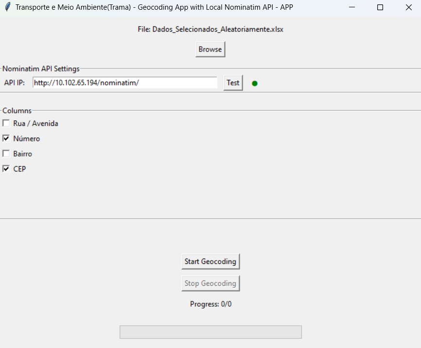

# Geocode with Local Nominatim

This Python project, `geocode-with-local-nominatim.py`, is designed for geocoding addresses using a local Nominatim server, now featuring a user-friendly graphical interface to facilitate the geocoding process. This version replaces the older TramaGeoPyNeo, introducing significant enhancements in user interaction, data processing capabilities, and overall efficiency.



## Features

- **Graphical User Interface**: Simplifies file selection and geocoding configurations, enhancing user experience.
- **Excel File Support**: Direct processing of Excel files (`*.xlsx`, `*.xls`), extending beyond the previous CSV-only support.
- **Nominatim API Connection Testing**: Enables users to verify the availability of the local Nominatim server directly through the GUI.
- **Column Selection for Geocoding**: Users can select specific input file columns to be used in the geocoding process.
- **Multithreaded Geocoding**: Improves GUI responsiveness and allows for user-controlled interruption.
- **Enhanced Error Handling and Logging**: Provides better tracking and troubleshooting capabilities throughout the geocoding process.

## Requirements

- Python 3.x
- External libraries: tkinter, pandas, requests, threading, logging, json, os

## Installation

1. Clone the repository (update the link if necessary).
2. Install the required dependencies:

    ```bash
    pip install -r requirements.txt
    ```

## Executable Version

An executable version of the application has been created using PyInstaller and is available in the `\dist\geocode-with-local-nominatim` directory for easier access and deployment.

## Usage

1. Run the script `geocode-with-local-nominatim.py` or the executable version to launch the application.
2. Use the GUI to select the input Excel file.
3. Configure the local Nominatim server IP and other preferences as required.
4. Choose the columns to be used for geocoding and start the process.

## Contributing

Contributions to improve `geocode-with-local-nominatim` are welcomed! Please feel free to submit pull requests or open issues to discuss proposed changes or report bugs.

## License

This project is licensed under the GNU GENERAL PUBLIC LICENSE Version 3, dated June 29, 2007.
